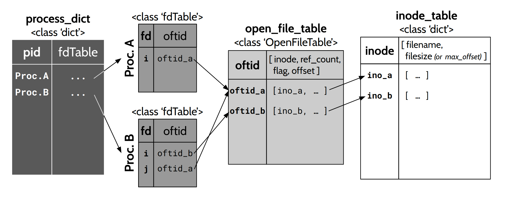

# File I/O analysis

## Extract only the traces related to file I/O
### 1. `inode_assign.py` : Get filename-inode list
**filename** | **inode**
---- | ----
filename1 | 3157
filename2 | 3181
filename3 | 1049001
 

### 2. `trace_organize.py` : Assemble parameters for each read/write operation
**time** | **pid** | **ppid** | **op** | **fd** | **offset** | **length** | **inode**
---- | ---- | ---- | ---- | ---- | ---- | ---- | ---- 
02:56:35.695250 | 530864 | 530864 | read | 3 | 0 | 1315 | 3157
02:56:35.695267 | 530864 | 530864 | pread64 | 3 | 1315 | 0 | 3157
02:56:35.695283 | 530864 | 530864 | pread64 | 3 | 0 | 4096 | 3181
02:56:35.695298 | 530864 | 530864 | pread64 | 3 | 4096 | 4096 | 3181
02:56:35.706275 | 530875 | 530864 | read | 4 | 17754230 | 30 | 1049001
02:56:35.706412 | 530875 | 530864 | read | 4 | 17754260 | 13 | 1049001
02:56:35.706530 | 530875 | 530864 | read | 4 | 20498031 | 30 | 1049001
02:56:35.706646 | 530875 | 530864 | read | 4 | 20498061 | 13 | 1049001
02:56:35.706765 | 530875 | 530864 | read | 4 | 23807882 | 30 | 1049001
02:56:35.706943 | 530875 | 530864 | read | 4 | 23807912 | 13 | 1049001

#### Data Structure
  
> Reference: https://web.archive.org/web/20160422100533if_/http://www.cs.ucsb.edu/~rich/class/cs170/notes/FileSystem/
 

### 3. `trace_refine.py` : Arrange read/write operation per each block
**time** | **time_interval** | **pid** | **operation** | **blocknum** | **inode** | **blk_offset**
---- | ---- | ---- | ---- | ---- | ---- | ----
02:56:35.695250 | 0.000000 | 530864 | read | 0 | 3157 | 0
02:56:35.695283 | 0.000033 | 530864 | read | 1 | 3181 | 0
02:56:35.695298 | 0.000048 | 530864 | read | 2 | 3181 | 1
02:56:35.706275 | 0.011025 | 530875 | read | 3 | 1049001 | 4334
02:56:35.706412 | 0.011162 | 530875 | read | 3 | 1049001 | 4334
02:56:35.706530 | 0.011280 | 530875 | read | 4 | 1049001 | 5004
02:56:35.706646 | 0.011396 | 530875 | read | 4 | 1049001 | 5004
02:56:35.706765 | 0.011515 | 530875 | read | 5 | 1049001 | 5812
02:56:35.706943 | 0.011693 | 530875 | read | 5 | 1049001 | 5812

> [!NOTE]
> **blk_offset** : offset of a block referenced within a file  
> The unit of **blk_offset** is block size (default: `4 KB`), while the unit of **offset** is `Byte`.
 

## Analyze file I/O characteristics
### A. `statistics/` : Calculate access distribution and access bias
* `refcount_per_block.py`
* `popularity.py`

### B. `simulator/` : Analyze file I/O characteristics using a simulator
* `buffer_cache/` calculates the fault rate of the buffer cache using the following replacement policy simulators:
  * LFU (Least Frequently Used)
  * LRU (Least Recently Used)
  * MRU (Most Recently Used)
  * CLOCK-Pro
    * Reference: https://github.com/dgryski/go-clockpro
  * CACHEUS
    * Reference: https://github.com/sylab/cacheus

* `estimator/` compares the prediction efficiency of different estimators using an access pattern simulator based on the following ranking methods:
  * recency ranking
  * frequency ranking