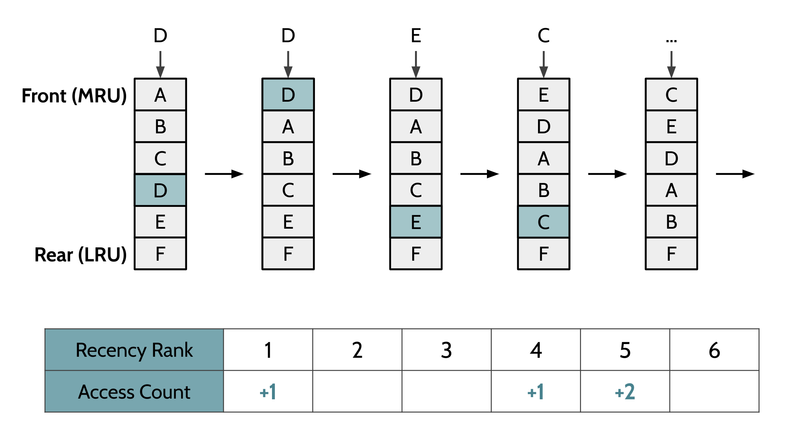
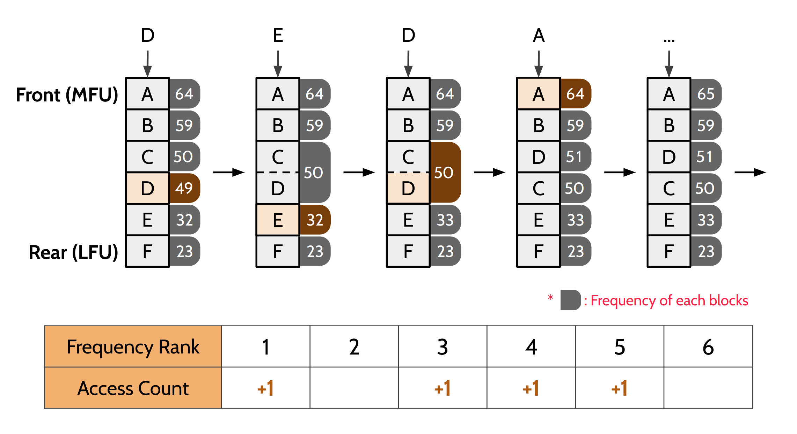
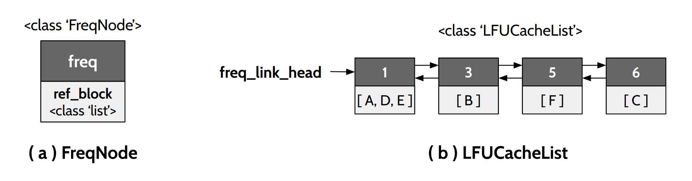
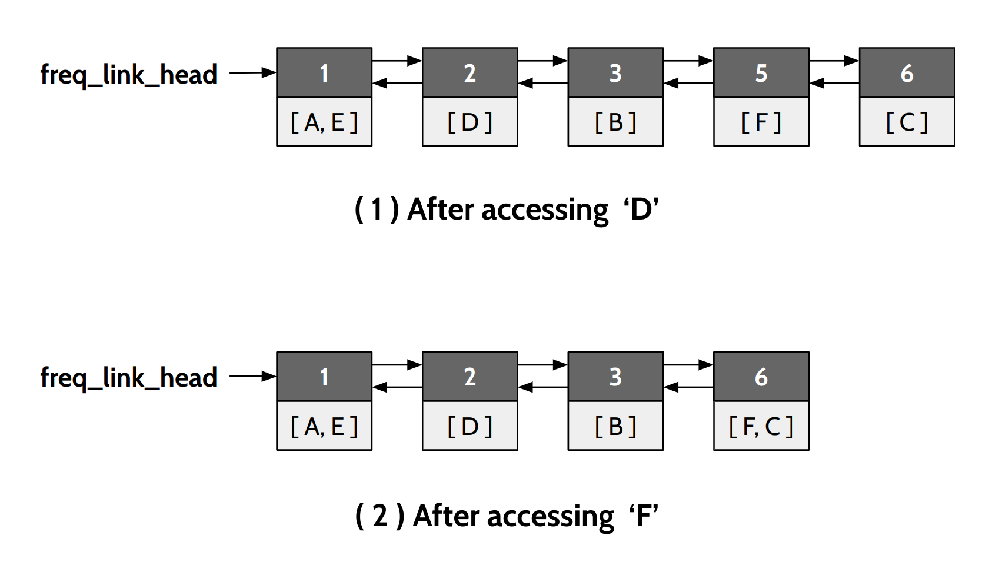

# Estimating Re-Access Likelihood

### 1. `recency.py` : Evaluating the effect of re-reference estimation based on temporal locality

  
> 1. Access `Block D` → `Block D` is ranked 4 → Increment the count for rank 4 by 1
> 2. Access `Block D` → `Block D` is ranked 1 → Increment the count for rank 1 by 1
> 3. Access `Block E` → `Block E` is ranked 5 → Increment the count for rank 5 by 1
> 4. Access `Block C` → `Block C` is ranked 5 → Increment the count for rank 5 by 1

 

### 2. `frequency.py` : Evaluating the effect of re-reference estimation based on access frequency
* Reference: https://medium.com/@epicshane/a-python-implementation-of-lfu-least-frequently-used-cache-with-o-1-time-complexity-e16b34a3c49b

  
> 1. Access `Block D` → `Block D` is ranked 4 → Increment the count for rank 4 by 1
> 2. Access `Block E` → `Block E` is ranked 5 → Increment the count for rank 5 by 1
> 3. Access `Block D` → `Block D` is ranked 3* → Increment the count for rank 3 by 1
>     * \* tied with `Block C`
> 4. Access `Block A` → `Block A` is ranked 1 → Increment the count for rank 1 by 1

#### Data Structure for `LFUCacheList`
  

#### How it works

